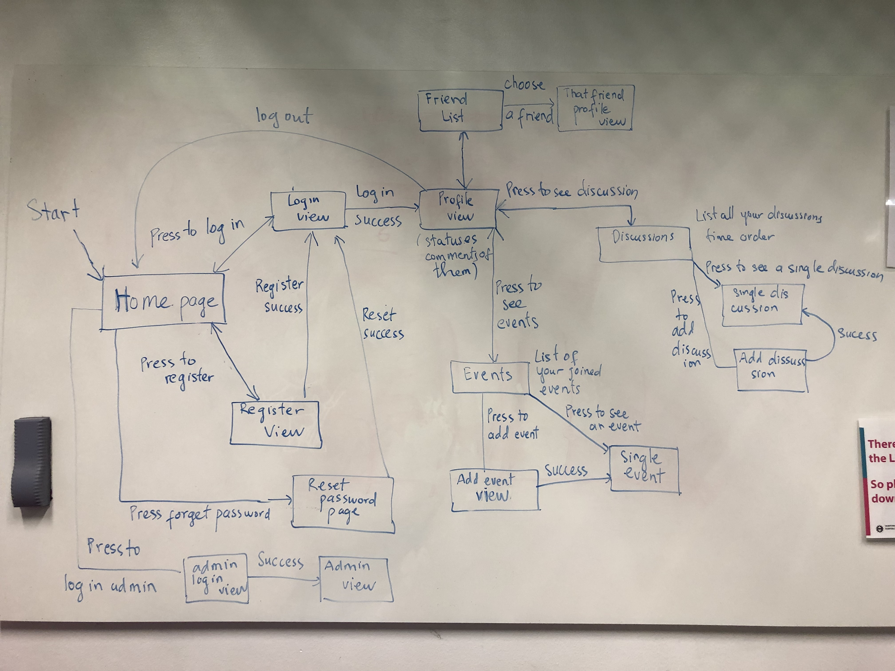
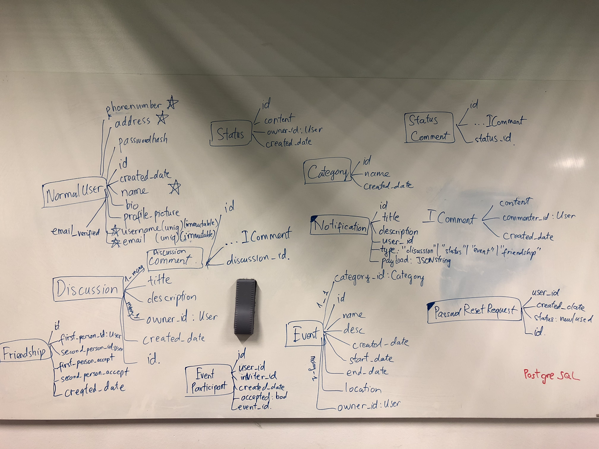

Heroku deployment url: [https://bwa-project.herokuapp.com](https://bwa-project.herokuapp.com)

## Demo login information

#### Administrator accounts
* Usernames: ```admin1``` and ```admin2```.

#### Normal accounts
* Usernames: ```normaluser1```, ```normaluser2```, ```normaluser3```, ```normaluser4```, ```normaluser5```

#### All demo accounts have password of ```bwaproject2018```

## Pages and navigation

Before seeing the site map, there are two important notices:

* All pages after logging in can go back to the profile view (there will be a button to go back to that view).
* The web application will present a navigation bar that will help to jump between pages easily - that is hard to present in the site map.

Here is the site map (drew during the second project meeting):



## Technological considerations

### Django apps in your Django project

We are going to have 7 Django apps:
1. Users: ```/users``` This app will manage users of the project, registration, authentication, email verification and password reset.
2. Profile: ```/profile``` This app will manage user's statuses in profile, users' friend list.
3. Gravatar: This app is an utility app that fetch profile pictures from Gravatar based on user's email
4. Status: ```/status```. This app will manage user's statuses in profile
5. Discussions: ```/discussions``` This app will manage user's discussions
6. Events: ```/events``` This app will manage user's events
7. Notifications *(Optional)*: ```/notifications``` This app will manage user's notifications

### Needed Django models and their attributes

During the first meeting we have already defined a map for models in the app.

Update: If user deletes himself from the database, all his/her contents (discussions, statuses, friendships, ...) will be deleted



### URIs

* For ```users``` app, we will have:
1. ```/```: home page
2. ```/login```: Login page
3. ```/logout```: Logout page
4. ```/about```: Some info about our group
5. ```/register```: Registration page
* For ```profile``` app, we will have:
1. ```/profile```: main page of profile that will show user's statuses
2. ```/profile/friends```: Showing friend lists and manage friend list
* For ```discussions``` app, we will have:
1. ```/discussions```: main page that shows all discussions that can be seen from that user in a time order.
2. ```/discussions/new```: view for adding a new discussion.
3. ```/discussions/:id```: view a single discussion.
* For ```events``` app, we will have:
1. ```/events```: main page that shows all events that can be seen from that user in a time order.
2. ```/events/new```: view for adding a new event.
3. ```/events/:id```: view a single event.
* For ```notifications``` app, we will have:
1. ```/notifications```: this is not really accessible from user, this route will return results that list user's notifications.

### Needed Django views and templates

1. Views: Every uri defined above will have its own view. The parameter has been defined in the uri itself, which is ```:<parameter_name>```. All above views will render a template, except for the ```notifications``` route, it will render a JSON response for the front-end to do AJAX to fetch notifications.

2. Templates: N/A

### Heroku deployment

As mentioned in the group information, here is the heroku deployment url: [https://bwa-project.herokuapp.com](https://bwa-project.herokuapp.com)

## Testing

Hai will be responsible for project testing.

We will be following Test Driven Development, which we have a convention that each team member will submit a merge request for every change to ```master```. In order for it to be merged, Hai will help to write unit tests for the features.

We will also be doing manual testing, that is using the app as a normal user and see if anything behaves unexpectedly.

## Project timetable and division of work

As mentioned in the section of mandatory and plus features, all assignees for each features have been defined.

Each member will commit at least 10 hours of work each week.

Hai as the project team leader will be responsible for gitlab issues creation and assigning.

>>>
_`The Django project in this repo (bwa2018djangoproject), was created for the groups using Heroku Django Starter Template. The information about it left here for educational purposes. The groups are free to remove this text and all the text below it from this file.`_
# Heroku Django Starter Template

An utterly fantastic project starter template for Django 2.0.

## Features

- Production-ready configuration for Static Files, Database Settings, Gunicorn, etc.
- Enhancements to Django's static file serving functionality via WhiteNoise.
- Latest Python 3.6 runtime environment.

## How to Use

To use this project, follow these steps:

1. Create your working environment.
2. Install Django (`$ pipenv install django`)
3. Create a new project using this template

## Creating Your Project

Using this template to create a new Django app is easy::

    $ django-admin.py startproject --template=https://github.com/heroku/heroku-django-template/archive/master.zip --name=Procfile helloworld

(If this doesn't work on windows, replace `django-admin.py` with `django-admin`)

You can replace ``helloworld`` with your desired project name.

## Deployment to Heroku

    $ git init
    $ git add -A
    $ git commit -m "Initial commit"

    $ heroku create
    $ git push heroku master

    $ heroku run python manage.py migrate

See also, a [ready-made application](https://github.com/heroku/python-getting-started), ready to deploy.


## License: MIT

## Further Reading

- [Gunicorn](https://warehouse.python.org/project/gunicorn/)
- [WhiteNoise](https://warehouse.python.org/project/whitenoise/)
- [dj-database-url](https://warehouse.python.org/project/dj-database-url/)

>>>
